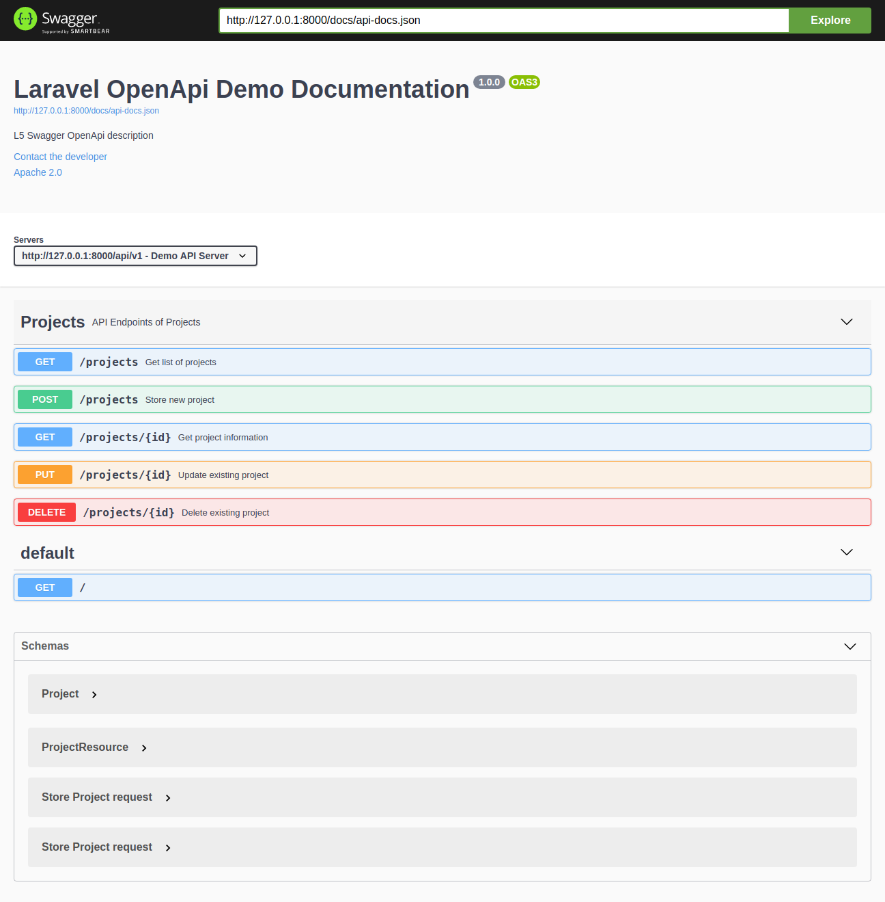
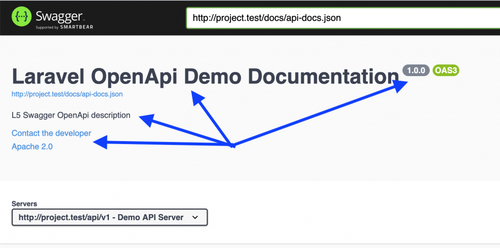
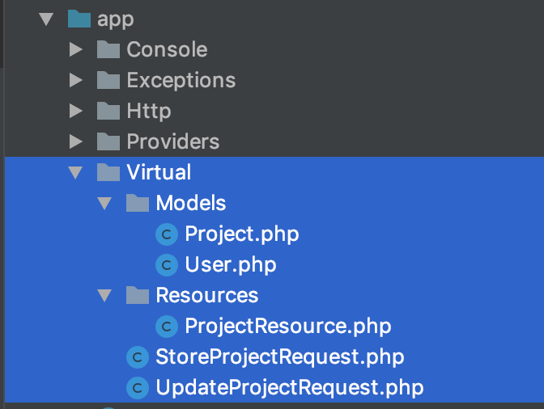

# Swagger-Laravel-API-Documentation
A documentation repository to help make api documentation using swagger in laravel



# In this article, we will have these sections:

1. __Short Intro:__ What is OpenAPI and How Does it Work?
2. __Preparation:__ Initial Laravel API Code
3. Installing Laravel Swagger Package
4. Writing Comments and Generating Documentation
5. At the end of the article, you will find a link to Github repository example.

# Short Intro: What is OpenAPI and How Does it Work?

First, a few words about what OpenAPI/Swagger is.

Formerly called Swagger (quite often called this even now), OpenAPI is a standard of documenting APIs. Its specification is available <a href="https://github.com/OAI/OpenAPI-Specification">on Github here</a>.

The official definition <a href="https://www.openapis.org">from their homepage</a>: “The OpenAPI Specification: a broadly adopted industry standard for describing modern APIs.”

Keep in mind that it’s not a Laravel API standard. Not even PHP language standard. It’s API schema that can be used for any programming language. It’s like a set of rules that can be adapted to your framework.

For Laravel specifically, there were a few packages created, and we will use one of them: <a href="https://github.com/DarkaOnLine/L5-Swagger">DarkaOnLine/L5-Swagger</a>

Let’s take a look at the end result – here’s the documentation page that will be generated automatically from your code comments:


Inside this page, you can click on items to expand them and get more information.

And all of it because you have written some comments, like these:

```php
class ProjectsApiController extends Controller
{
    /**
     * @OA\Get(
     *      path="/projects",
     *      operationId="getProjectsList",
     *      tags={"Projects"},
     *      summary="Get list of projects",
     *      description="Returns list of projects",
     *      @OA\Response(
     *          response=200,
     *          description="Successful operation",
     *          @OA\JsonContent(ref="#/components/schemas/ProjectResource")
     *       ),
     *      @OA\Response(
     *          response=401,
     *          description="Unauthenticated",
     *      ),
     *      @OA\Response(
     *          response=403,
     *          description="Forbidden"
     *      )
     *     )
     */
    public function index()
    {
        abort_if(Gate::denies('project_access'), Response::HTTP_FORBIDDEN, '403 Forbidden');

        return new ProjectResource(Project::with(['author'])->get());
    }

```

So, this is a short overview, now let’s get deeper and show you how to generate the documentation step-by-step.

# Preparation: Initial Laravel API Code

First, I will show the base code of API structure, it may be useful to learn even if you’re not planning to generate documentation.

Imagine you have a model __Project__ and all API action for it: index, store, update, show, destroy.

So, here’s __routes/api.php__:

```php
Route::group([
  'prefix' => 'v1', 
  'as' => 'api.', 
  'namespace' => 'Api\V1\Admin', 
  'middleware' => ['auth:api']
], function () {
    Route::apiResource('projects', 'ProjectsApiController');
});
```

In this example, we put the __ProjectsApiController__ inside of __V1/Admin__ subfolder.

So here’s the code of our __app/Http/Controllers/V1/Admin/ProjectsApiController.php__

```php
namespace App\Http\Controllers\Api\V1\Admin;

use App\Http\Controllers\Controller;
use App\Http\Requests\StoreProjectRequest;
use App\Http\Requests\UpdateProjectRequest;
use App\Http\Resources\Admin\ProjectResource;
use App\Project;
use Gate;
use Illuminate\Http\Request;
use Symfony\Component\HttpFoundation\Response;

class ProjectsApiController extends Controller
{
    public function index()
    {
        abort_if(Gate::denies('project_access'), Response::HTTP_FORBIDDEN, '403 Forbidden');

        return new ProjectResource(Project::with(['author'])->get());
    }

    public function store(StoreProjectRequest $request)
    {
        $project = Project::create($request->all());

        return (new ProjectResource($project))
            ->response()
            ->setStatusCode(Response::HTTP_CREATED);
    }

    public function show(Project $project)
    {
        abort_if(Gate::denies('project_show'), Response::HTTP_FORBIDDEN, '403 Forbidden');

        return new ProjectResource($project->load(['author']));
    }

    public function update(UpdateProjectRequest $request, Project $project)
    {
        $project->update($request->all());

        return (new ProjectResource($project))
            ->response()
            ->setStatusCode(Response::HTTP_ACCEPTED);
    }

    public function destroy(Project $project)
    {
        abort_if(Gate::denies('project_delete'), Response::HTTP_FORBIDDEN, '403 Forbidden');

        $project->delete();

        return response(null, Response::HTTP_NO_CONTENT);
    }
}
```

Here are a few additional things we need to mention:
- We use <a href="https://laravel.com/docs/master/authorization#gates">Laravel Gates</a> to restrict the access;
- We use <a href="https://laravel.com/docs/master/eloquent-resources">API Resources</a> to return the response data;
- We use <a href="https://laravel.com/docs/master/validation#form-request-validation">Form Request</a> classes to validate the input data.

Here’s one of those files – __app/Http/Resources/Admin/ProjectResource.php__:

```php
namespace App\Http\Resources\Admin;

use Illuminate\Http\Resources\Json\JsonResource;

class ProjectResource extends JsonResource
{
    public function toArray($request)
    {
        return parent::toArray($request);
    }
}
```

Also, for validation – __app/Http/Requests/StoreProjectRequest.php__:

```php
namespace App\Http\Requests;

use Gate;
use Illuminate\Foundation\Http\FormRequest;
use Symfony\Component\HttpFoundation\Response;

class StoreProjectRequest extends FormRequest
{
    public function authorize()
    {
        abort_if(Gate::denies('project_create'), Response::HTTP_FORBIDDEN, '403 Forbidden');
        return true;
    }

    public function rules()
    {
        return [
            'name' => [
                'required',
            ],
        ];
    }
}
```
So, here’s our beginning. Now, let’s start generating the documentation with OpenAPI.

# Installing Laravel Swagger Package

One of the most popular packages to generate OpenAPI documentation in Laravel is <a href="https://github.com/DarkaOnLine/L5-Swagger">DarkaOnLine/L5-Swagger</a>.

Don’t be confused by the name – it didn’t change the name part of Swagger to OpenAPI, but it actually supports both standards. Also “L5” in the name is not important either – current Laravel 6 is supported well.

So, we install the package:

` composer require darkaonline/l5-swagger `

Next, following installation instructions in Readme, we publish config/views from Service Provider:

`php artisan vendor:publish --provider "L5Swagger\L5SwaggerServiceProvider"`

Finally, we have __config/l5-swagger.php__ file with huge amount of options:

```php
[
        /*
        |--------------------------------------------------------------------------
        | Edit to set the api's title
        |--------------------------------------------------------------------------
        */

        'title' => 'L5 Swagger UI',
    ],

    'routes' => [
        /*
        |--------------------------------------------------------------------------
        | Route for accessing api documentation interface
        |--------------------------------------------------------------------------
        */

        'api' => 'api/documentation',

        // ...

    ],

    // ... many more options

    /*
    |--------------------------------------------------------------------------
    | Uncomment to add constants which can be used in annotations
    |--------------------------------------------------------------------------
     */
    'constants' => [
        'L5_SWAGGER_CONST_HOST' => env('L5_SWAGGER_CONST_HOST', 'http://my-default-host.com'),
    ],
];
```

For this example, we will edit the __title__ from ‘L5 Swagger UI’ to ‘Projects API’, and add this into __.env__ file:

`L5_SWAGGER_CONST_HOST=http://project.test/api/v1`

And then we should launch this magic command:

`php artisan l5-swagger:generate`

It should generate a JSON file, which then will be transformed into HTML page.

But, for now, it won’t generate anything, cause __we haven’t added any comments anywhere__. Shall we?

# Writing Comments and Generating Documentation

This is probably the main part of this article – rules on how to write those comments and where exactly.
The package will scan all your files and look for the patterns of OpenAPI-related comments.

So, what types of comments we need to add?

- Global: Project comments
- Local: Controller/Method comments
- Virtual: Models, Validation and Response comments

I will just list the comments here, for more information on their logic please refer to the <a href="https://github.com/DarkaOnLine/L5-Swagger/blob/master/tests/storage/annotations/OpenApi/Anotations.php">short examples inside of the Laravel package</a>, or to the <a href="https://github.com/OAI/OpenAPI-Specification/blob/master/versions/2.0.md">detailed OpenAPI official specification</a>.

# Comment Type 1: Global

We need to provide the information about the whole project, and for that, we create a separate file – an empty Controller which wouldn’t even be used anywhere – __app/Http/Controllers/Api/Controller.php__:

```php
class Controller
{
    /**
     * @OA\Info(
     *      version="1.0.0",
     *      title="Laravel OpenApi Demo Documentation",
     *      description="L5 Swagger OpenApi description",
     *      @OA\Contact(
     *          email="admin@admin.com"
     *      ),
     *      @OA\License(
     *          name="Apache 2.0",
     *          url="http://www.apache.org/licenses/LICENSE-2.0.html"
     *      )
     * )
     * 
     * @OA\Get(
     *     path="/",
     *     description="Home page",
     *     @OA\Response(response="default", description="Welcome page")
     * )
     *
     * @OA\Server(
     *      url=L5_SWAGGER_CONST_HOST,
     *      description="Demo API Server"
     * )

     *
     * @OA\Tag(
     *     name="Projects",
     *     description="API Endpoints of Projects"
     * )
     */
}
```

These variables will help generate the main information in documentation page header:



<hr>

# Comment Type 2: Controllers Methods

To describe every API endpoint, we need to add comments annotations on top of every method in API Controllers.

So here’s a full example of our __app/Http/Controllers/Api/V1/Admin/ProjectsApiController.php__:

```php
class ProjectsApiController extends Controller
{
    /**
     * @OA\Get(
     *      path="/projects",
     *      operationId="getProjectsList",
     *      tags={"Projects"},
     *      summary="Get list of projects",
     *      description="Returns list of projects",
     *      @OA\Response(
     *          response=200,
     *          description="Successful operation",
     *          @OA\JsonContent(ref="#/components/schemas/ProjectResource")
     *       ),
     *      @OA\Response(
     *          response=401,
     *          description="Unauthenticated",
     *      ),
     *      @OA\Response(
     *          response=403,
     *          description="Forbidden"
     *      )
     *     )
     */
    public function index()
    {
        abort_if(Gate::denies('project_access'), Response::HTTP_FORBIDDEN, '403 Forbidden');

        return new ProjectResource(Project::with(['author'])->get());
    }

    /**
     * @OA\Post(
     *      path="/projects",
     *      operationId="storeProject",
     *      tags={"Projects"},
     *      summary="Store new project",
     *      description="Returns project data",
     *      @OA\RequestBody(
     *          required=true,
     *          @OA\JsonContent(ref="#/components/schemas/StoreProjectRequest")
     *      ),
     *      @OA\Response(
     *          response=201,
     *          description="Successful operation",
     *          @OA\JsonContent(ref="#/components/schemas/Project")
     *       ),
     *      @OA\Response(
     *          response=400,
     *          description="Bad Request"
     *      ),
     *      @OA\Response(
     *          response=401,
     *          description="Unauthenticated",
     *      ),
     *      @OA\Response(
     *          response=403,
     *          description="Forbidden"
     *      )
     * )
     */
    public function store(StoreProjectRequest $request)
    {
        $project = Project::create($request->all());

        return (new ProjectResource($project))
            ->response()
            ->setStatusCode(Response::HTTP_CREATED);
    }

    /**
     * @OA\Get(
     *      path="/projects/{id}",
     *      operationId="getProjectById",
     *      tags={"Projects"},
     *      summary="Get project information",
     *      description="Returns project data",
     *      @OA\Parameter(
     *          name="id",
     *          description="Project id",
     *          required=true,
     *          in="path",
     *          @OA\Schema(
     *              type="integer"
     *          )
     *      ),
     *      @OA\Response(
     *          response=200,
     *          description="Successful operation",
     *          @OA\JsonContent(ref="#/components/schemas/Project")
     *       ),
     *      @OA\Response(
     *          response=400,
     *          description="Bad Request"
     *      ),
     *      @OA\Response(
     *          response=401,
     *          description="Unauthenticated",
     *      ),
     *      @OA\Response(
     *          response=403,
     *          description="Forbidden"
     *      )
     * )
     */
    public function show(Project $project)
    {
        abort_if(Gate::denies('project_show'), Response::HTTP_FORBIDDEN, '403 Forbidden');

        return new ProjectResource($project->load(['author']));
    }

    /**
     * @OA\Put(
     *      path="/projects/{id}",
     *      operationId="updateProject",
     *      tags={"Projects"},
     *      summary="Update existing project",
     *      description="Returns updated project data",
     *      @OA\Parameter(
     *          name="id",
     *          description="Project id",
     *          required=true,
     *          in="path",
     *          @OA\Schema(
     *              type="integer"
     *          )
     *      ),
     *      @OA\RequestBody(
     *          required=true,
     *          @OA\JsonContent(ref="#/components/schemas/UpdateProjectRequest")
     *      ),
     *      @OA\Response(
     *          response=202,
     *          description="Successful operation",
     *          @OA\JsonContent(ref="#/components/schemas/Project")
     *       ),
     *      @OA\Response(
     *          response=400,
     *          description="Bad Request"
     *      ),
     *      @OA\Response(
     *          response=401,
     *          description="Unauthenticated",
     *      ),
     *      @OA\Response(
     *          response=403,
     *          description="Forbidden"
     *      ),
     *      @OA\Response(
     *          response=404,
     *          description="Resource Not Found"
     *      )
     * )
     */
    public function update(UpdateProjectRequest $request, Project $project)
    {
        $project->update($request->all());

        return (new ProjectResource($project))
            ->response()
            ->setStatusCode(Response::HTTP_ACCEPTED);
    }

    /**
     * @OA\Delete(
     *      path="/projects/{id}",
     *      operationId="deleteProject",
     *      tags={"Projects"},
     *      summary="Delete existing project",
     *      description="Deletes a record and returns no content",
     *      @OA\Parameter(
     *          name="id",
     *          description="Project id",
     *          required=true,
     *          in="path",
     *          @OA\Schema(
     *              type="integer"
     *          )
     *      ),
     *      @OA\Response(
     *          response=204,
     *          description="Successful operation",
     *          @OA\JsonContent()
     *       ),
     *      @OA\Response(
     *          response=401,
     *          description="Unauthenticated",
     *      ),
     *      @OA\Response(
     *          response=403,
     *          description="Forbidden"
     *      ),
     *      @OA\Response(
     *          response=404,
     *          description="Resource Not Found"
     *      )
     * )
     */
    public function destroy(Project $project)
    {
        abort_if(Gate::denies('project_delete'), Response::HTTP_FORBIDDEN, '403 Forbidden');

        $project->delete();

        return response(null, Response::HTTP_NO_CONTENT);
    }
}
```

Wow, it feels like A LOT of comments, right?
But that’s the correct way of preparing the documentation – you need to describe all the methods, all the cases, all the parameters, all the exceptions.

# Comment Type 3: Model, Validation and Response

You may have noticed some references to external files in the comments in the Controller above. So what is __StoreProjectRequest__ there? We define all of those rules in our folder called __app/Virtual__, see the list of files:



Let’s take a look inside of __app/Virtual/Models/Project.php__:

```php
/**
 * @OA\Schema(
 *     title="Project",
 *     description="Project model",
 *     @OA\Xml(
 *         name="Project"
 *     )
 * )
 */
class Project
{

    /**
     * @OA\Property(
     *     title="ID",
     *     description="ID",
     *     format="int64",
     *     example=1
     * )
     *
     * @var integer
     */
    private $id;

    /**
     * @OA\Property(
     *      title="Name",
     *      description="Name of the new project",
     *      example="A nice project"
     * )
     *
     * @var string
     */
    public $name;

    /**
     * @OA\Property(
     *      title="Description",
     *      description="Description of the new project",
     *      example="This is new project's description"
     * )
     *
     * @var string
     */
    public $description;

    /**
     * @OA\Property(
     *     title="Created at",
     *     description="Created at",
     *     example="2020-01-27 17:50:45",
     *     format="datetime",
     *     type="string"
     * )
     *
     * @var \DateTime
     */
    private $created_at;

    /**
     * @OA\Property(
     *     title="Updated at",
     *     description="Updated at",
     *     example="2020-01-27 17:50:45",
     *     format="datetime",
     *     type="string"
     * )
     *
     * @var \DateTime
     */
    private $updated_at;

    /**
     * @OA\Property(
     *     title="Deleted at",
     *     description="Deleted at",
     *     example="2020-01-27 17:50:45",
     *     format="datetime",
     *     type="string"
     * )
     *
     * @var \DateTime
     */
    private $deleted_at;

    /**
     * @OA\Property(
     *      title="Author ID",
     *      description="Author's id of the new project",
     *      format="int64",
     *      example=1
     * )
     *
     * @var integer
     */
    public $author_id;


    /**
     * @OA\Property(
     *     title="Author",
     *     description="Project author's user model"
     * )
     *
     * @var \App\Virtual\Models\User
     */
    private $author;
}
```
See, we need to define every property of that __Project__ model, including relationship to the author.

Now, what about form validation requests? See __app/Virtual/StoreProjectRequest.php__:

```php
/**
 * @OA\Schema(
 *      title="Store Project request",
 *      description="Store Project request body data",
 *      type="object",
 *      required={"name"}
 * )
 */

class StoreProjectRequest
{
    /**
     * @OA\Property(
     *      title="name",
     *      description="Name of the new project",
     *      example="A nice project"
     * )
     *
     * @var string
     */
    public $name;

    /**
     * @OA\Property(
     *      title="description",
     *      description="Description of the new project",
     *      example="This is new project's description"
     * )
     *
     * @var string
     */
    public $description;

    /**
     * @OA\Property(
     *      title="author_id",
     *      description="Author's id of the new project",
     *      format="int64",
     *      example=1
     * )
     *
     * @var integer
     */
    public $author_id;
}
```

Almost a copy-paste, right?

Finally, we need to define API Resource, which would be __“data”__ in our case – in __app/Virtual/Resources/ProjectResource.php__:

```php
/**
 * @OA\Schema(
 *     title="ProjectResource",
 *     description="Project resource",
 *     @OA\Xml(
 *         name="ProjectResource"
 *     )
 * )
 */
class ProjectResource
{
    /**
     * @OA\Property(
     *     title="Data",
     *     description="Data wrapper"
     * )
     *
     * @var \App\Virtual\Models\Project[]
     */
    private $data;
}
```

And, that’s finally it! We can run this artisan command once again:
` php artisan l5-swagger:generate `

Ta-daaa!

And if you click on any endpoint, it expands with all the parameters you provided, and even with example response – that’s the biggest beauty:


Finally, a nice small thing on this documentation page is that you can click __“Try it out”__ (see top-right of the screenshot above) and it would try to actually run that API call. But keep in mind that you have to be authenticated exactly as your API requests.
